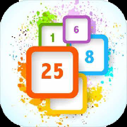

# 项目简介

# 功能
## 登录/注册
用户名
密码
邮箱
## 管理员功能

管理员用户名：admin
管理员密码：admin
### 查看/添加/删除/修改用户信息
## 游戏功能

### 字体
选择游戏界面字体
默认字体
### 难度
#### 普通（标准）
顺序点击，点错变红，记录错误次数
#### 困难
顺序点击，点错游戏失败
#### 挑战
顺序点击，每次点击完成后数字打乱，点错游戏失败
### 背景音乐
可以切换背景音乐
### 大小
#### 标准 （5*5）
#### 小（3*3）
### 数据查看

#### 个人统计图
每次用时折线图
#### 用户排名
所有用户最短用时排名表
#### 个人统计表
每次游戏时间，用时，失误次数统计表
### 用户信息
#### 退出登录
#### 修改信息
# 参考资料

