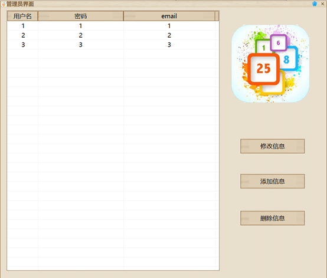
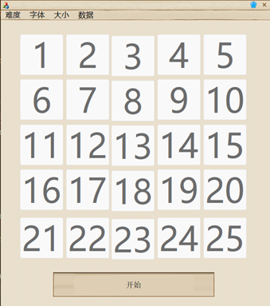
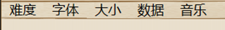
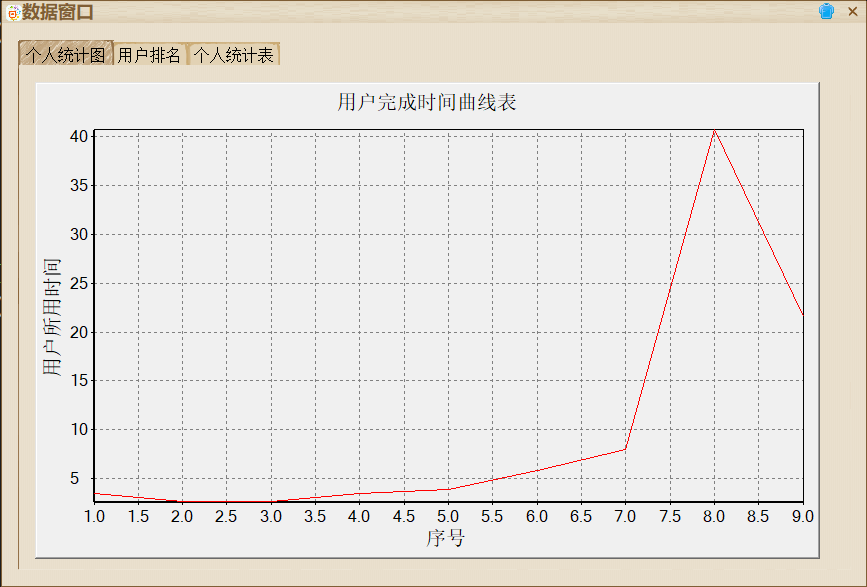

 
# MFC舒尔特方格

使用前请先安装JMail
# 项目简介

舒尔特方格 (Schulte Grid) 是在一张方形卡片上画上 1cm*1cm 的 25 个方格，格子内任意填写上阿拉伯数字 1 ~ 25 等共 25 个数字。训练时，要求被测者用手指按 1 ~ 25 的顺序依次指出其位置，同时诵读出声，施测者一旁记录所用时间。数完 25 个数字所用时间越短，注意力水平越高。
# 功能
## 登录/注册

用户名
密码
邮箱
## 管理员功能

管理员用户名：admin
管理员密码：admin
### 查看/添加/删除/修改用户信息
## 游戏功能

### 字体
选择游戏界面字体
默认字体
### 难度
#### 普通（标准）
顺序点击，点错变红，记录错误次数
#### 困难
顺序点击，点错游戏失败
#### 挑战
顺序点击，每次点击完成后数字打乱，点错游戏失败
### 背景音乐
可以切换背景音乐
### 大小
#### 标准 （5*5）
#### 小（3*3）
### 数据查看

#### 个人统计图
每次用时折线图
#### 用户排名
所有用户最短用时排名表
#### 个人统计表
每次游戏时间，用时，失误次数统计表
### 用户信息
#### 退出登录
#### 修改信息
# 参考资料
音效和美术素材来源于网络

[vc++ 利用jmail组件收发邮件](https://blog.csdn.net/shixin_0125/article/details/105346339)

[MFC-StudentsManage](http://gitee.com/TastSong/MFC-StudentsManage?_from=gitee_search)

[High-speed Charting Control](http://blog.csdn.net/puzzleZHOU/article/details/117730586)

[教你用代码奏响天空之城！](https://blog.csdn.net/weixin_45697774/article/details/106868403)

[C++ Beep函数播放歌曲《千本樱》](https://blog.csdn.net/qq_53162179/article/details/124066525)

[MFC编程入门教程之目录和总结](http://www.jizhuomi.com/software/257.html)

[Git教程](https://www.liaoxuefeng.com/wiki/896043488029600)